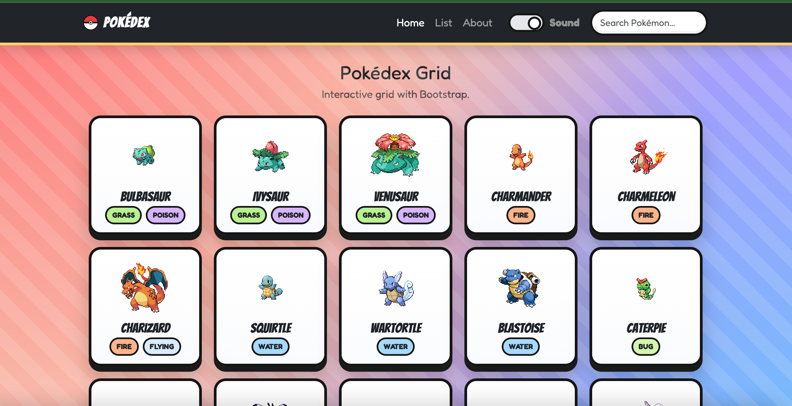
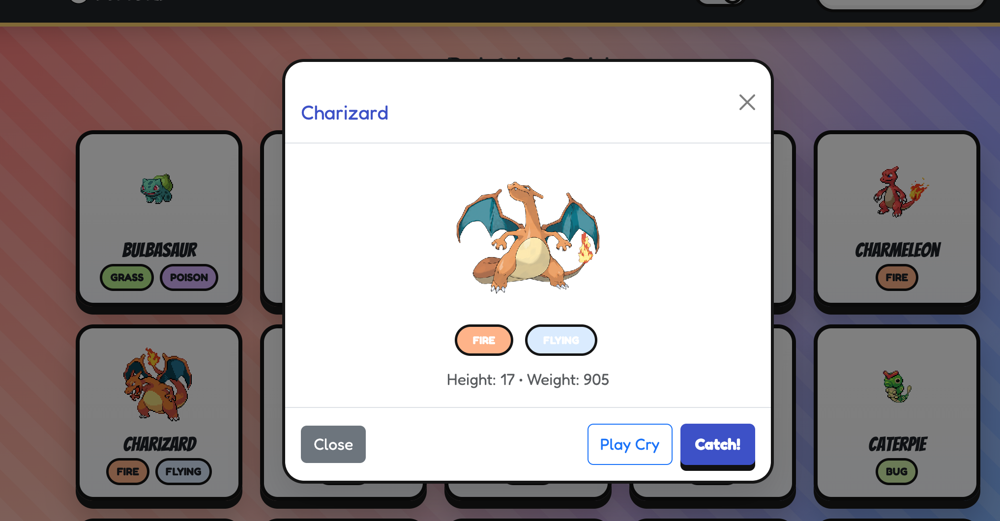

Here’s an updated README in plain text that explicitly covers deploying through GitHub Pages (step-by-step). Paste this into README.md.

Title: Pokédex (Cartoon Grid)

A lightweight, cartoon-styled Pokédex built with HTML, CSS, and JavaScript plus Bootstrap 5.Features a square card grid, details modal, search, optional cry sounds, and a clean ESLint + Prettier setup.Deployed on GitHub Pages with minified assets in the dist/ folder.

Live: https://michaelkassie.github.io/Pokedex/

FEATURES
--------

*   Square card grid (responsive) with sprites and type chips
    
*   Instant search filter
    
*   Details modal with height, weight, and types
    
*   Sound toggle and “Play Cry” (optional local audio files)
    
*   “Catch!” button with small confetti burst
    
*   ESLint v9 (flat config) and Prettier for consistent code
    
*   Minified CSS/JS via csso and terser in dist/
    
*   Progressive enhancement: noscript fallback and simple loading states
    

SCREENSHOTS
-----------

Add images to a screenshots/ folder and reference them here:

* Grid: 
   

* Modal: 
   

PROJECT STRUCTURE
-----------------

Project structure — explained (bullet format)
=============================================

*   **index.html**
    
    *   The main page. Must link to dist/styles.min.css and dist/script.min.js.
        
    *   Keeps Bootstrap CDN and fonts; includes a
        
        fallback.
        
*   **css/**
    
    *   styles.css — your **source** CSS (human-edited).
        
*   **js/**
    
    *   script.js — your **source** JavaScript (human-edited).
        
*   **dist/**
    
    *   styles.min.css, script.min.js — **built/minified** files (generated by npm run build).
        
    *   Commit these so GitHub Pages can serve them. Don’t edit by hand.
        
*   **assets/images/**
    
    *   pokeball.svg and any other images.
        
*   **assets/sounds/** _(optional)_
    
    *   Pokémon cry MP3s (named exactly like the Pokémon in lowercase, e.g., pikachu.mp3).
        
    *   These can be large; you can keep them, or add to .gitignore if you prefer not to store them.
        
*   **eslint.config.js**
    
    *   ESLint v9 **flat config** (CommonJS). Also holds the ignores list (replaces .eslintignore).
        
*   **.prettierrc.json**
    
    *   Prettier formatting rules (single quotes, 100 line width, etc.).
        
*   **README.md**
    
    *   Project description, setup, scripts, deployment, screenshots, links.
        
*   **package.json / package-lock.json**
    
    *   Scripts (lint, format, build, etc.) and dev dependencies (eslint, prettier, terser, csso-cli).
        

DEPLOYMENT (GITHUB PAGES)
-------------------------

This project is designed to deploy via GitHub Pages.

A) One-time setup

1.  Commit your code and push to the main branch.
    
2.  In your GitHub repository, go to Settings -> Pages.
    
3.  Under “Source”, choose “Deploy from a branch”.
    
4.  Select the branch “main” and the folder “/(root)”.
    
5.  Click Save. GitHub Pages will build and publish your site at:https://.github.io//
    

B) Before each deployment

1.  Run the build to generate minified assets:npm run build
    
2.  Confirm index.html points to the minified files:
    
3.  Commit and push:git add .git commit -m "build: minify assets for deployment"git push
    

D) Troubleshooting

*   Blank page or 404: ensure the Pages “Source” is main / root, and wait a minute for Pages to publish.
    
*   Wrong paths: asset paths must be relative (e.g., dist/script.min.js). Do not use absolute file system paths.
    
*   Case sensitivity: filenames on GitHub Pages are case-sensitive (e.g., styles.css ≠ Styles.css).
    
*   Console errors: open DevTools -> Console to see missing file or CORS errors.
    
*   Custom domain: set it in Settings -> Pages and create the correct DNS records (optional).
    

CONFIGURATION
-------------

ESLint v9 (Flat Config)

*   Config file: eslint.config.js (CommonJS)
    
*   Ignores: dist/**, node\_modules/**, and the config file itself
    
*   Rules include:
    
    *   Enforce single quotes
        
    *   eqeqeq with “smart” option
        
    *   Allow empty catch blocks when intentional
        
    *   Warn on console usage except console.warn and console.error
        

Prettier

*   .prettierrc.json settings:
    
    *   singleQuote: true
        
    *   printWidth: 100
        
    *   semi: true
        
    *   trailingComma: es5
        

ACCESSIBILITY
-------------

*   Semantic headings and labels (aria attributes on modal and search).
    
*   Sufficient color contrast; visible focus styles retained.
    
*   Images include alt text. Decorative images should use empty alt attributes when applicable.
    

TECH STACK
----------

*   HTML5, CSS3, JavaScript
    
*   Bootstrap 5 (layout and modal)
    
*   ESLint v9 (flat config), Prettier
    
*   Build tools: terser and csso-cli
    
*   Data source: PokéAPI ([https://pokeapi.co/](https://pokeapi.co/))
    

ROADMAP
-------

*   Offline caching with a Service Worker for sprites and basic data
    
*   Favorites or caught list using localStorage
    
*   Type filters and sorting controls
    
*   Pagination or infinite scroll
    

